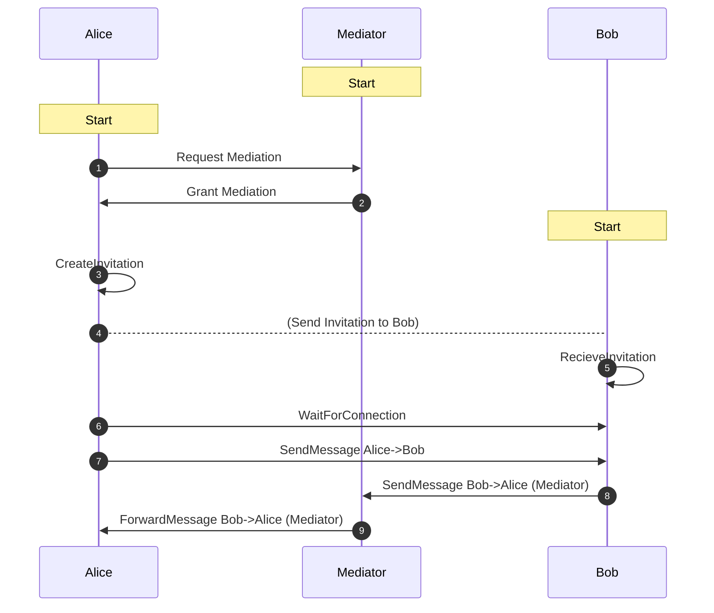

# Mediation

> This section assumes that you have:
>
> 1. Set up a [valid environment](../getting-started/installation) for development
> 2. Basic knowledge of the required fields in the [agent
>    config](./agent-config)
>
> The agent setup varies depending on your target environment, React Native or Node.js.  
> This tutorial assumes a Node.js environment for all agents (Alice, Bob, Meditator).

This tutorial shows how to set up a mediator, how to configure an agent to use a mediator, and how agents exchange messages with a mediator in place.
Concepts are explained in isolation:

- [First](./mediation.md#1-mediator-setup), it is shown how to set up a mediator.
- [Second](./mediation.md#2-recipient-alice-setup), it is demonstrated how to use a mediator.
- [Third](./mediation.md#3-message-exchange), the message exchange between agents with a mediator in place is explained.

### What is a mediator, and Why should I use one?

A mediator is just a special type of agent.

:::info
"When we describe agent-to-agent communication, it is convenient to think of an interaction only in terms of Alice and Bob and their agents. We say things like: "Alice's agent sends a message to Bob's agent" -- or perhaps "Alice's edge agent sends a message to Bob's cloud agent, which forwards it to Bob's edge agent".

Such statements adopt a useful level of abstraction--one that's highly recommended for most discussions. However, they make a number of simplifications. By modeling the roles of mediators and relays in routing, we can support routes that use multiple transports, routes that are not fully known (or knowable) to the sender, routes that pass through mix networks, and other advanced and powerful concepts."[Aries RFC 0046: Mediators and Relays](https://github.com/hyperledger/aries-rfcs/blob/main/concepts/0046-mediators-and-relays/README.md#aries-rfc-0046-mediators-and-relays)

:::

A practical example where the use of mediators is beneficial can be found in a mobile environment. A mobile agent, aka. your mobile wallet, receives messages from other agents. Technically, sending HTTP messages to a mobile agent is impossible because the agent does not have a public IP. As you have probably seen in previous examples, a workaround for this scenario is to use ngrok. Another option is to use a mediator. When an agent is configured to use a mediator, messages to that agent are routed through the mediator and from there to its destination. Thus, a mobile agent can use a "public" mediator to receive messages on its behalf and poll them from time to time.

This is just one example of how a mediator can be used. Further resources about mediators can be found [here](./mediation.md#useful-resources).

:::tip

With mediators, WebSockets come in handy. In a production environment, it is recommendable to register a `WsInboundTransport()` for Alice and a `WsOutboundTransport()` for the mediator. These WebSocket transports allow the mediator to push messages to Alice instead of having Alice pull messages from the mediator repeatedly.
:::

### 1. Mediator setup

The first part shows how to set up a mediator agent. Generally, there are two ways to do that: deploying it from scratch or using a third-party mediator. This section focuses on the former approach, setting up the mediator from scratch.

The mediator is set up on port 3001 and creates an Out-of-Band invitation that allows multiple other agents to connect to the mediator. Configuring an agent as a mediator demands utilizing the `MediatorModule`. In this example, the `autoAcceptMediationRequests` flag is set to true to accept mediation requests automatically.

```typescript showLineNumbers mediator-setup.ts section-1

```

### 2. Recipient (Alice) setup

The second part shows how to use a mediator. Becoming a recipient of a mediator requires using the `RecipientModule`. The setup is the same whether you use your own or a third-party mediator.

The easiest way to set everything up is by configuring the `RecipientModule` to connect to the mediator on agent startup. This can be done by constructing the module with the `mediatorInvitationUrl`. You can get the mediatorInvitationUrl either from [part one](./mediation.md#1-mediator-setup) by running a mediator yourself or from a public mediator such as the animo-mediator. The following snippet uses the latter approach.

The `ConnectionsModule` used in this snippet serves the sole purpose of automatically accepting connections and thus simplifying setup.

```typescript showLineNumbers mediation-recipient.ts section-1

```

:::info
In case you are using a third-party mediator and cannot create an invitationUrl, it is common practice for mediators to provide an endpoint from which the invitationUrl can be fetched.
:::

### 3. Message exchange

This section explains the message exchange between agents when a mediator is in place. The process is illustrated using the diagram below. Parts [one](./mediation.md#1-mediator-setup) and [two](./mediation.md#2-recipient-alice-setup) of this tutorial showed how to set up and use a mediator. If the `mediatorInvitationUrl` is specified when constructing the `RecipientModule` (as in [Part two](./mediation.md#2-recipient-alice-setup)), the mediation request and grant _(1-2)_ between Alice and the mediator will be performed automatically when Alice's agent is started.

If Alice establishes a connection with another fictional agent, say, Bob's agent, who is not using any mediators _(3-6)_. (Connection establishment is no different when a mediator is involved). Then, messages from Alice to Bob _(7)_ are routed directly to Bob, while messages from Bob to Alice _(8-9)_ are routed through the intermediary.



### Useful resources

For more information about mediator refer to:

- [Aries Mediator Coordination Protocol](https://github.com/hyperledger/aries-rfcs/tree/main/features/0211-route-coordination)
- [Hyperledger Aries Mediator Agent](https://aries-mediator.animo.id/#/)
- [Aries RFC 0046: Mediators and Relays](https://github.com/hyperledger/aries-rfcs/blob/main/concepts/0046-mediators-and-relays/README.md#aries-rfc-0046-mediators-and-relays)
